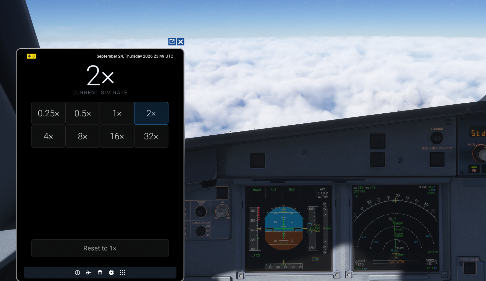
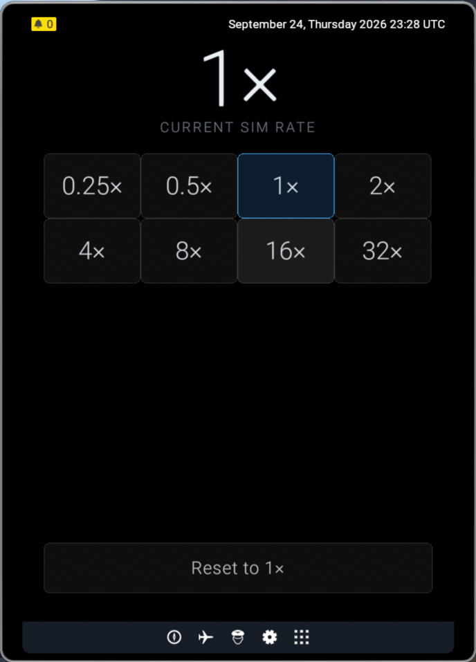
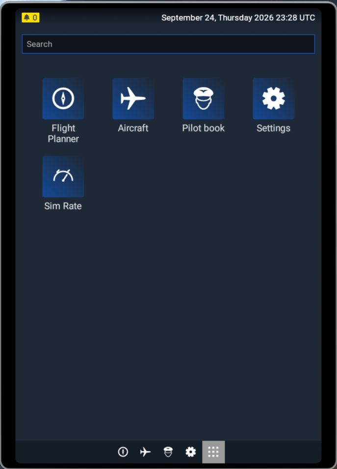

# Sim Rate Panel

An EFB app for Microsoft Flight Simulator 2024. Pick a simulation rate from
0.25× to 32×, and see the rate the sim is actually running at.



<p>
  
  
</p>

## Install

1. Download the zip from [Releases](../../releases) and extract it.
2. Drop the extracted folder into your Community folder. On Steam that is
   `%APPDATA%\Microsoft Flight Simulator 2024\Packages\Community\`; on any
   install, `InstalledPackagesPath` in `UserCfg.opt` points at the folder that
   contains it. The folder's name doesn't matter.
3. Restart the sim. **Sim Rate** appears in the EFB app list.

Tested on Steam under Linux/Proton.

## Notes

The readout follows the sim, not your last tap — change the rate with a keybind
and the panel keeps up. The sim refuses rate changes while paused and caps the
rate in multiplayer; when that happens the panel says so rather than appearing
to do nothing.

If the app doesn't show up, turn on Dev Mode (Options → General → Developers)
and look for `[EFB] App registered` in the console.

## Development

No build step, no dependencies. The app is three files under
`html_ui/efb_ui/efb_apps/SimRateApp/`; the rest is tests and tooling.

```bash
node --test                   # 36 tests
node tools/build-layout.mjs   # regenerate layout.json after editing a shipped file
```

Two conventions to keep if you edit it: the shipped files are pure ASCII with
non-ASCII written as `\uXXXX` escapes, and `layout.json` keeps each file's real
case — lowercasing it breaks the package under Wine.

## License

MIT — see [LICENSE](LICENSE).
